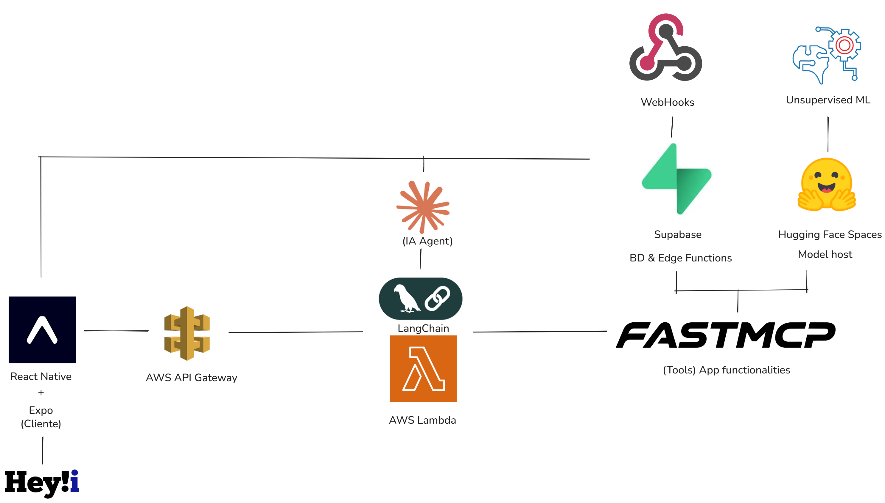

# Hey!i — Asistente Financiero Inteligente

> Datathon Hey Banco · 2026

**Hey!i** es una aplicación móvil de inteligencia financiera personalizada que analiza el comportamiento financiero del usuario y ofrece insights accionables, visualizaciones en tiempo real y un asistente conversacional impulsado por IA.

---

## El Problema

Los usuarios de banca digital tienen acceso a sus datos financieros, pero rara vez reciben orientación sobre qué hacer con ellos. Las notificaciones genéricas no generan acción; los resúmenes de cuenta no priorizan lo que importa.

**Hey!i convierte datos financieros en decisiones.**

---

## La Solución

Una capa de inteligencia sobre la cuenta Hey Banco que:

- Segmenta al usuario en su perfil financiero real (inversor, estresado, inactivo, etc.)
- Genera insights personalizados con base en su comportamiento transaccional
- Visualiza su salud financiera de forma clara y accionable
- Permite conversar con un asesor financiero IA en lenguaje natural

---

## Arquitectura



### Repositorios

| Componente | Repositorio |
|---|---|
| ML Pipeline | [JpAboytes/hey-i-pipeline](https://github.com/JpAboytes/hey-i-pipeline) |
| Lambda (Backend) | [abrahamsldev/Hey-i-Lambda](https://github.com/abrahamsldev/Hey-i-Lambda) |
| MCP Server | [Jessebnda/Hey_i_MCP](https://github.com/Jessebnda/Hey_i_MCP) |
| Hugging Face Spaces | [Orbit05/Datathon206](https://huggingface.co/spaces/Orbit05/Datathon206/tree/main) |


## Segmentos de Usuario

Hey!i clasifica a cada usuario en uno de 7 perfiles para personalizar su experiencia:

| Segmento | Acción generada |
|---|---|
| Inversor Premium | Upsell a productos de inversión avanzados |
| Nativo Digital | Cashback y productos digitales |
| Empresario Diversificado | Crédito empresarial |
| Pagador Gobierno | Reactivación de productos |
| Inactivo en Riesgo | Prevención de churn |
| Asalariado Fiel | Beneficios de nómina y lealtad |
| Estresado Financiero | Apoyo y reestructura de gastos |


## Estructura del Proyecto

```
Hey-i/
├── app/                    # Pantallas (Expo Router, file-based)
│   ├── index.tsx           # Entry point con redirección de auth
│   ├── login.tsx           # Login / Registro / Recuperación
│   └── (drawer)/
│       └── (tabs)/
│           ├── home/       # Dashboard, Salud Financiera, Insights
│           ├── chatbot/    # Asistente IA
│           └── profile/    # Perfil y configuración
├── components/             # Componentes reutilizables + charts
├── services/               # Integración con APIs (chat, dashboard, insights)
├── context/                # AuthContext global
├── types/                  # Definiciones TypeScript
├── constants/              # Sistema de diseño (colores, tipografía, espaciado)
└── lib/
    └── supabase.ts         # Cliente Supabase
```

---


## Datathon

Este proyecto fue desarrollado para el **Datathon Hey Banco 2026**, con el objetivo de demostrar cómo la inteligencia artificial y el análisis de comportamiento financiero pueden transformar la experiencia del usuario dentro del ecosistema Hey Banco — pasando de una app transaccional a un verdadero asesor financiero de bolsillo.
